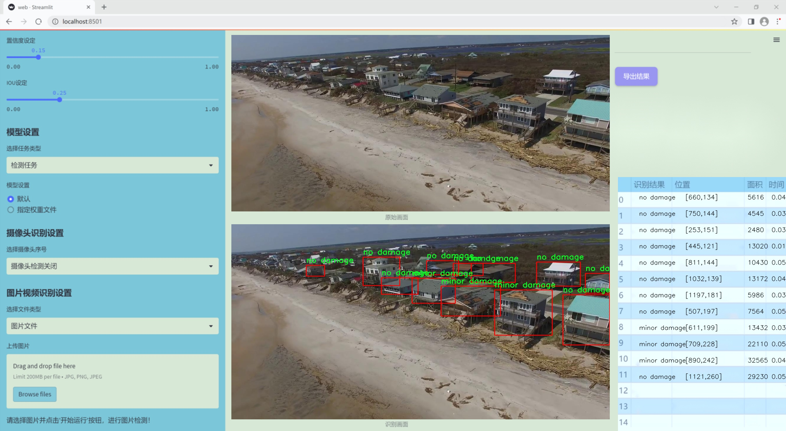
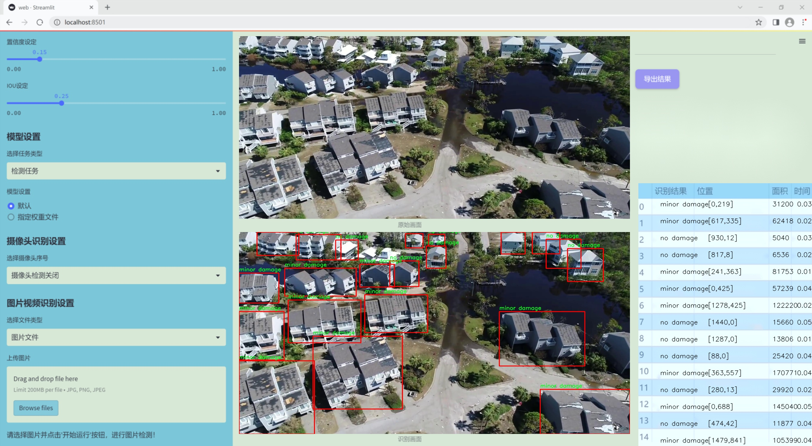
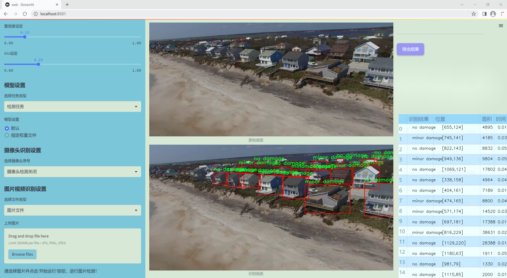
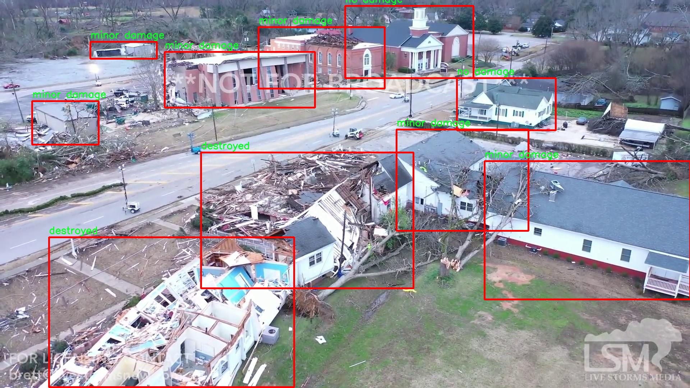
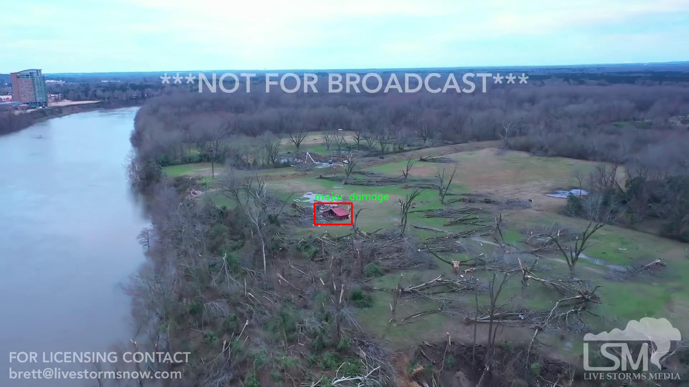
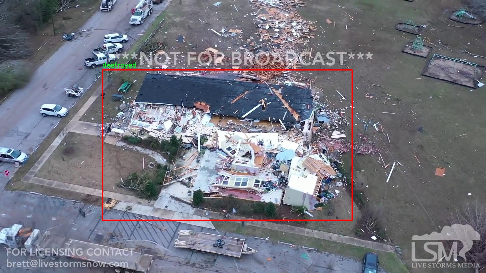
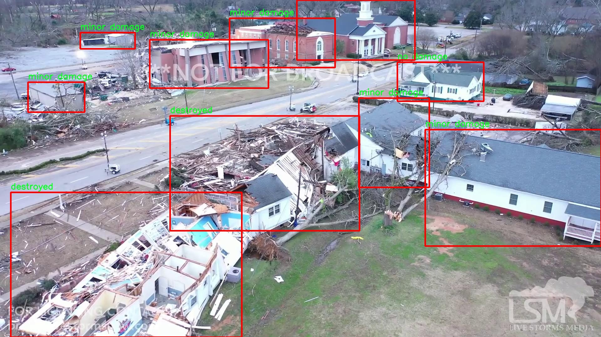
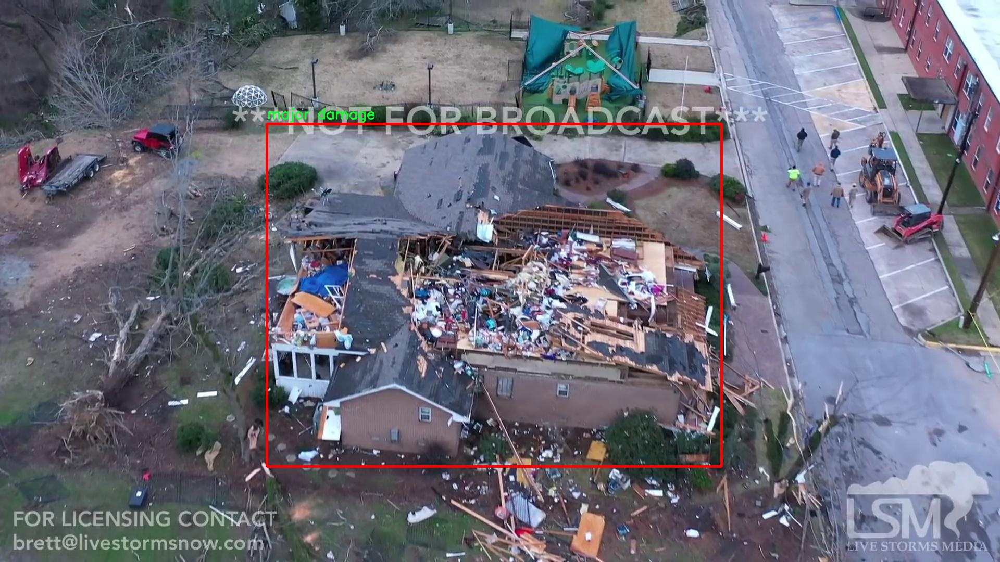

# 改进yolo11-dysample等200+全套创新点大全：建筑损毁程度检测评估系统源码＆数据集全套

### 1.图片效果展示







##### 项目来源 **[人工智能促进会 2024.11.01](https://kdocs.cn/l/cszuIiCKVNis)**

注意：由于项目一直在更新迭代，上面“1.图片效果展示”和“2.视频效果展示”展示的系统图片或者视频可能为老版本，新版本在老版本的基础上升级如下：（实际效果以升级的新版本为准）

  （1）适配了YOLOV11的“目标检测”模型和“实例分割”模型，通过加载相应的权重（.pt）文件即可自适应加载模型。

  （2）支持“图片识别”、“视频识别”、“摄像头实时识别”三种识别模式。

  （3）支持“图片识别”、“视频识别”、“摄像头实时识别”三种识别结果保存导出，解决手动导出（容易卡顿出现爆内存）存在的问题，识别完自动保存结果并导出到tempDir中。

  （4）支持Web前端系统中的标题、背景图等自定义修改。

  另外本项目提供训练的数据集和训练教程,暂不提供权重文件（best.pt）,需要您按照教程进行训练后实现图片演示和Web前端界面演示的效果。

### 2.视频效果展示

[2.1 视频效果展示](https://www.bilibili.com/video/BV1HvS9YpEwm/)

### 3.背景

研究背景与意义

随着城市化进程的加快，建筑物的损毁问题日益突出，尤其是在自然灾害、战争冲突及人为破坏等情况下，建筑物的安全性和完整性受到严重威胁。传统的建筑损毁评估方法往往依赖人工检查，不仅耗时耗力，而且容易受到主观因素的影响，导致评估结果的不准确性。因此，开发一种高效、准确的建筑损毁程度检测评估系统显得尤为重要。

近年来，深度学习技术的迅猛发展为物体检测和图像分类领域带来了新的机遇。YOLO（You Only Look Once）系列模型因其高效的实时检测能力和较高的准确率，成为了物体检测领域的研究热点。特别是YOLOv11模型，凭借其在特征提取和多尺度检测方面的优势，能够更好地适应复杂环境下的建筑损毁检测任务。本研究旨在基于改进的YOLOv11模型，构建一个专门针对建筑损毁程度的检测评估系统，以实现对建筑物损毁情况的快速、准确评估。

本项目所使用的数据集包含1000幅图像，涵盖了四个主要类别：碎片、毁坏、无损坏和严重损坏。这些类别的划分不仅能够帮助研究人员更清晰地理解建筑物的损毁程度，还能为后续的自动化评估提供重要的基础数据支持。通过对这些图像的深度学习训练，系统将能够自动识别和分类不同程度的建筑损毁情况，从而为灾后恢复、保险理赔及城市规划等提供科学依据。

综上所述，基于改进YOLOv11的建筑损毁程度检测评估系统的研究，不仅具有重要的理论意义，也在实际应用中具有广泛的前景。该系统的成功实施将为建筑安全管理提供有效的技术支持，推动建筑行业向智能化、自动化方向发展。

### 4.数据集信息展示

##### 4.1 本项目数据集详细数据（类别数＆类别名）

nc: 4
names: ['destroyed', 'major damage', 'minor damage', 'no damage']


该项目为【目标检测】数据集，请在【训练教程和Web端加载模型教程（第三步）】这一步的时候按照【目标检测】部分的教程来训练

##### 4.2 本项目数据集信息介绍

本项目数据集信息介绍

本项目所使用的数据集名为“ISBDA_classification”，旨在为改进YOLOv11的建筑损毁程度检测评估系统提供支持。该数据集专注于建筑物的损毁程度分类，包含四个主要类别，分别为“destroyed”（完全毁坏）、“major damage”（重大损坏）、“minor damage”（轻微损坏）和“no damage”（无损坏）。这些类别的划分不仅反映了建筑物在遭受自然灾害或人为破坏后的不同损毁状态，也为后续的损毁评估和修复决策提供了重要依据。

数据集的构建过程中，采用了多种数据采集技术，包括现场拍摄、无人机航拍以及卫星图像等，确保数据的多样性和代表性。每个类别的样本均经过精心标注，确保分类的准确性和一致性。这种高质量的标注对于训练深度学习模型至关重要，因为它直接影响到模型的学习效果和最终的检测精度。

在数据集的规模方面，ISBDA_classification包含了大量的图像样本，覆盖了不同类型和风格的建筑物，旨在增强模型的泛化能力。通过对这些样本的深入分析和处理，项目团队能够有效地训练YOLOv11，使其在实际应用中能够快速、准确地识别和评估建筑物的损毁程度。

总之，ISBDA_classification数据集为本项目提供了坚实的基础，助力于构建一个高效、可靠的建筑损毁检测系统，旨在提升灾后评估的效率和准确性，为灾后重建和救援工作提供科学依据。











### 5.全套项目环境部署视频教程（零基础手把手教学）

[5.1 所需软件PyCharm和Anaconda安装教程（第一步）](https://www.bilibili.com/video/BV1BoC1YCEKi/?spm_id_from=333.999.0.0&vd_source=bc9aec86d164b67a7004b996143742dc)


[5.2 安装Python虚拟环境创建和依赖库安装视频教程（第二步）](https://www.bilibili.com/video/BV1ZoC1YCEBw?spm_id_from=333.788.videopod.sections&vd_source=bc9aec86d164b67a7004b996143742dc)

### 6.改进YOLOv11训练教程和Web_UI前端加载模型教程（零基础手把手教学）

[6.1 改进YOLOv11训练教程和Web_UI前端加载模型教程（第三步）](https://www.bilibili.com/video/BV1BoC1YCEhR?spm_id_from=333.788.videopod.sections&vd_source=bc9aec86d164b67a7004b996143742dc)


按照上面的训练视频教程链接加载项目提供的数据集，运行train.py即可开始训练



     Epoch   gpu_mem       box       obj       cls    labels  img_size
     1/200     20.8G   0.01576   0.01955  0.007536        22      1280: 100%|██████████| 849/849 [14:42<00:00,  1.04s/it]
               Class     Images     Labels          P          R     mAP@.5 mAP@.5:.95: 100%|██████████| 213/213 [01:14<00:00,  2.87it/s]
                 all       3395      17314      0.994      0.957      0.0957      0.0843

     Epoch   gpu_mem       box       obj       cls    labels  img_size
     2/200     20.8G   0.01578   0.01923  0.007006        22      1280: 100%|██████████| 849/849 [14:44<00:00,  1.04s/it]
               Class     Images     Labels          P          R     mAP@.5 mAP@.5:.95: 100%|██████████| 213/213 [01:12<00:00,  2.95it/s]
                 all       3395      17314      0.996      0.956      0.0957      0.0845

     Epoch   gpu_mem       box       obj       cls    labels  img_size
     3/200     20.8G   0.01561    0.0191  0.006895        27      1280: 100%|██████████| 849/849 [10:56<00:00,  1.29it/s]
               Class     Images     Labels          P          R     mAP@.5 mAP@.5:.95: 100%|███████   | 187/213 [00:52<00:00,  4.04it/s]
                 all       3395      17314      0.996      0.957      0.0957      0.0845


###### [项目数据集下载链接](https://kdocs.cn/l/cszuIiCKVNis)

### 7.原始YOLOv11算法讲解


YOLO11 是 Ultralytics YOLO 系列的最新版本，结合了尖端的准确性、速度和效率，用于目标检测、分割、分类、定向边界框和姿态估计。与
YOLOv8 相比，它具有更少的参数和更好的结果，不难预见，YOLO11 在边缘设备上更高效、更快，将频繁出现在计算机视觉领域的最先进技术（SOTA）中。


**主要特点**

  * **增强的特征提取：**YOLO11 使用改进的主干和颈部架构来增强特征提取，以实现更精确的目标检测和复杂任务的性能。

  * **针对效率和速度优化：**精细的架构设计和优化的训练流程在保持准确性和性能之间最佳平衡的同时，提供更快的处理速度。

  * **更少的参数，更高的准确度：**YOLO11m 在 COCO 数据集上实现了比 YOLOv8m 更高的 mAP，参数减少了 22%，提高了计算效率，同时不牺牲准确度。

  * **跨环境的适应性：**YOLO11 可以无缝部署在边缘设备、云平台和配备 NVIDIA GPU 的系统上，确保最大的灵活性。

  * **支持广泛的任务范围：**YOLO11 支持各种计算机视觉任务，如目标检测、实例分割、图像分类、姿态估计和定向目标检测（OBB）。


### 8.200+种全套改进YOLOV11创新点原理讲解

#### 8.1 200+种全套改进YOLOV11创新点原理讲解大全

由于篇幅限制，每个创新点的具体原理讲解就不全部展开，具体见下列网址中的改进模块对应项目的技术原理博客网址【Blog】（创新点均为模块化搭建，原理适配YOLOv5~YOLOv11等各种版本）

[改进模块技术原理博客【Blog】网址链接](https://gitee.com/qunmasj/good)


#### 8.2 精选部分改进YOLOV11创新点原理讲解

###### 这里节选部分改进创新点展开原理讲解(完整的改进原理见上图和[改进模块技术原理博客链接](https://gitee.com/qunmasj/good)【如果此小节的图加载失败可以通过CSDN或者Github搜索该博客的标题访问原始博客，原始博客图片显示正常】


### D-LKA Attention简介
自2010年代中期以来，卷积神经网络（CNNs）已成为许多计算机视觉应用的首选技术。它们能够从原始数据中自动提取复杂的特征表示，无需手动进行特征工程，这引起了医学图像分析社区的极大兴趣。许多成功的CNN架构，如U-Net、全卷积网络、DeepLab或SegCaps（分割胶囊），已经被开发出来。这些架构在语义分割任务中取得了巨大成功，先前的最新方法已经被超越。

在计算机视觉研究中，不同尺度下的目标识别是一个关键问题。在CNN中，可检测目标的大小与相应网络层的感受野尺寸密切相关。如果一个目标扩展到超出这个感受野的边界，这可能会导致欠分割结果。相反，与目标实际大小相比使用过大的感受野可能会限制识别，因为背景信息可能会对预测产生不必要的影响。

解决这个问题的一个有希望的方法涉及在并行使用具有不同尺寸的多个Kernel，类似于Inception块的机制。然而，由于参数和计算要求的指数增长，将Kernel大小增加以容纳更大的目标在实践中受到限制。因此，出现了各种策略，包括金字塔池化技术和不同尺度的扩张卷积，以捕获多尺度的上下文信息。

另一个直观的概念涉及将多尺度图像金字塔或它们的相关特征表示直接纳入网络架构。然而，这种方法存在挑战，特别是在管理训练和推理时间方面的可行性方面存在挑战。在这个背景下，使用编码器-解码器网络，如U-Net，已被证明是有利的。这样的网络在较浅的层中编码外观和位置，而在更深的层中，通过神经元的更广泛的感受野捕获更高的语义信息和上下文信息。

一些方法将来自不同层的特征组合在一起，或者预测来自不同尺寸的层的特征以使用多尺度的信息。此外，出现了从不同尺度的层中预测特征的方法，有效地实现了跨多个尺度的见解整合。然而，大多数编码器-解码器结构面临一个挑战：它们经常无法在不同尺度之间保持一致的特征，并主要使用最后一个解码器层生成分割结果。

语义分割是一项任务，涉及根据预定义的标签集为图像中的每个像素预测语义类别。这项任务要求提取高级特征同时保留初始的空间分辨率。CNNs非常适合捕获局部细节和低级信息，尽管以忽略全局上下文为代价。视觉Transformer（ViT）架构已经成为解决处理全局信息的视觉任务的关键，包括语义分割，取得了显著的成功。

ViT的基础是注意力机制，它有助于在整个输入序列上聚合信息。这种能力使网络能够合并远程的上下文提示，超越了CNN的有限感受野尺寸。然而，这种策略通常会限制ViT有效建模局部信息的能力。这种局限可能会妨碍它们检测局部纹理的能力，这对于各种诊断和预测任务至关重要。这种缺乏局部表示可以归因于ViT模型处理图像的特定方式。

ViT模型将图像分成一系列Patch，并使用自注意力机制来模拟它们之间的依赖关系。这种方法可能不如CNN模型中的卷积操作对感受野内提取局部特征有效。ViT和CNN模型之间的这种图像处理方法的差异可能解释了CNN模型在局部特征提取方面表现出色的原因。

近年来，已经开发出创新性方法来解决Transformer模型内部局部纹理不足的问题。其中一种方法是通过互补方法将CNN和ViT特征结合起来，以结合它们的优势并减轻局部表示的不足。TransUNet是这种方法的早期示例，它在CNN的瓶颈中集成了Transformer层，以模拟局部和全局依赖关系。HiFormer提出了一种解决方案，将Swin Transformer模块和基于CNN的编码器结合起来，生成两个多尺度特征表示，通过Double-Level Fusion模块集成。UNETR使用基于Transformer的编码器和CNN解码器进行3D医学图像分割。CoTr和TransBTS通过Transformer在低分辨率阶段增强分割性能，将CNN编码器和解码器连接在一起。

增强局部特征表示的另一种策略是重新设计纯Transformer模型内部的自注意力机制。在这方面，Swin-Unet在U形结构中集成了一个具有线性计算复杂性的Swin Transformer块作为多尺度 Backbone 。MISSFormer采用高效Transformer来解决视觉Transformer中的参数问题，通过在输入块上进行不可逆的降采样操作。D-Former引入了一个纯Transformer的管道，具有双重注意模块，以分段的方式捕获细粒度的局部注意和与多元单元的交互。然而，仍然存在一些特定的限制，包括计算效率低下，如TransUNet模型所示，对CNN Backbone 的严重依赖，如HiFormer所观察到的，以及对多尺度信息的忽略。

此外，目前的分割架构通常采用逐层处理3D输入 volumetric 的方法，无意中忽视了相邻切片之间的潜在相关性。这一疏忽限制了对 volumetric 信息的全面利用，因此损害了定位精度和上下文集成。此外，必须认识到，医学领域的病变通常在形状上发生变形。因此，用于医学图像分析的任何学习算法都必须具备捕捉和理解这些变形的能力。与此同时，该算法应保持计算效率，以便处理3D volumetric数据。

为了解决上述提到的挑战，作者提出了一个解决方案，即可变形大卷积核注意力模块（Deformable LKA module），它是作者网络设计的基本构建模块。这个模块明确设计成在有效处理上下文信息的同时保留局部描述符。作者的架构在这两个方面的平衡增强了实现精确语义分割的能力。

值得注意的是，参考该博客引入了一种基于数据的感受野的动态适应，不同于传统卷积操作中的固定滤波器Mask。这种自适应方法使作者能够克服与静态方法相关的固有限制。这种创新方法还扩展到了D-LKA Net架构的2D和3D版本的开发。

在3D模型的情况下，D-LKA机制被量身定制以适应3D环境，从而实现在不同 volumetric 切片之间无缝信息交互。最后，作者的贡献通过其计算效率得到进一步强调。作者通过仅依靠D-LKA概念的设计来实现这一点，在各种分割基准上取得了显著的性能，确立了作者的方法作为一种新的SOTA方法。

在本节中，作者首先概述方法论。首先，作者回顾了由Guo等人引入的大卷积核注意力（Large Kernel Attention，LKA）的概念。然后，作者介绍了作者对可变形LKA模块的创新探索。在此基础上，作者介绍了用于分割任务的2D和3D网络架构。

大卷积核提供了与自注意力机制类似的感受野。可以通过使用深度卷积、深度可扩展卷积和卷积来构建大卷积核，从而减少了参数和计算量。构建输入维度为和通道数的卷积核的深度卷积和深度可扩展卷积的卷积核大小的方程如下：


具有卷积核大小和膨胀率。参数数量和浮点运算（FLOPs）的计算如下：


FLOPs的数量与输入图像的大小成线性增长。参数的数量随通道数和卷积核大小的增加而呈二次增长。然而，由于它们通常都很小，因此它们不是限制因素。

为了最小化对于固定卷积核大小K的参数数量，可以将方程3对于膨胀率的导数设定为零：


例如，当卷积核大小为时，结果是。将这些公式扩展到3D情况是直接的。对于大小为和通道数C的输入，3D情况下参数数量和FLOPs 的方程如下：


具有卷积核大小和膨胀。


利用大卷积核进行医学图像分割的概念通过引入可变形卷积得以扩展。可变形卷积可以通过整数偏移自由调整采样网格以进行自由变形。额外的卷积层从特征图中学习出变形，从而创建一个偏移场。基于特征本身学习变形会导致自适应卷积核。这种灵活的卷积核形状可以提高病变或器官变形的表示，从而增强了目标边界的定义。

负责计算偏移的卷积层遵循其相应卷积层的卷积核大小和膨胀。双线性插值用于计算不在图像网格上的偏移的像素值。如图2所示，D-LKA模块可以表示为：


其中输入特征由表示，。表示为注意力图，其中每个值表示相应特征的相对重要性。运算符  表示逐元素乘法运算。值得注意的是，LKA不同于传统的注意力方法，它不需要额外的规范化函数，如或。这些规范化函数往往忽视高频信息，从而降低了基于自注意力的方法的性能。

在该方法的2D版本中，卷积层被可变形卷积所替代，因为可变形卷积能够改善对具有不规则形状和大小的目标的捕捉能力。这些目标在医学图像数据中常常出现，因此这种增强尤为重要。

然而，将可变形LKA的概念扩展到3D领域会带来一定的挑战。主要的约束来自于需要用于生成偏移的额外卷积层。与2D情况不同，由于输入和输出通道的性质，这一层无法以深度可分的方式执行。在3D环境中，输入通道对应于特征，而输出通道扩展到，其中是卷积核的大小。大卷积核的复杂性导致沿第3D的通道数扩展，导致参数和FLOPs大幅增加。因此，针对3D情况采用了另一种替代方法。在现有的LKA框架中，深度卷积之后引入了一个单独的可变形卷积层。这种战略性的设计调整旨在减轻扩展到3D领域所带来的挑战。


2D网络的架构如图1所示。第一变种使用MaxViT作为编码器组件，用于高效特征提取，而第二变种则结合可变形LKA层进行更精细、卓越的分割。

在更正式的描述中，编码器生成4个分层输出表示。首先，卷积干扰将输入图像的维度减小到。随后，通过4个MaxViT块的4个阶段进行特征提取，每个阶段后跟随降采样层。随着过程进展到解码器，实施了4个阶段的D-LKA层，每个阶段包含2个D-LKA块。然后，应用Patch扩展层以实现分辨率上采样，同时减小通道维度。最后，线性层负责生成最终的输出。

2D D-LKA块的结构包括LayerNorm、可变形LKA和多层感知器（MLP）。积分残差连接确保了有效的特征传播，即使在更深层也是如此。这个安排可以用数学方式表示为：


其中输入特征，层归一化LN，可变形LKA注意力，深度卷积，线性层和GeLU激活函数。

3D网络架构如图1所示，采用编码器-解码器设计进行分层结构化。首先，一个Patch嵌入层将输入图像的维度从（）减小到（）。在编码器中，采用了3个D-LKA阶段的序列，每个阶段包含3个D-LKA块。在每个阶段之后，通过降采样步骤将空间分辨率减半，同时将通道维度加倍。中央瓶颈包括另一组2个D-LKA块。解码器结构与编码器相对称。

为了将特征分辨率加倍，同时减少通道数，使用转置卷积。每个解码器阶段都使用3个D-LKA块来促进远距离特征依赖性。最终的分割输出由一个卷积层产生，后面跟随一个卷积层以匹配特定类别的通道要求。

为了建立输入图像和分割输出之间的直接连接，使用卷积形成了一个跳跃连接。额外的跳跃连接根据简单的加法对来自其他阶段的特征进行融合。最终的分割图是通过和卷积层的组合产生的。

3D D-LKA块包括层归一化，后跟D-LKA注意力，应用了残差连接的部分。随后的部分采用了一个卷积层，后面跟随一个卷积层，两者都伴随着残差连接。这个整个过程可以总结如下：


带有输入特征 、层归一化 、可变形 LKA 、卷积层 和输出特征 的公式。是指一个前馈网络，包括2个卷积层和激活函数。

表7显示了普通卷积和构建卷积的参数数量比较。尽管标准卷积的参数数量在通道数较多时急剧增加，但分解卷积的参数总体较低，并且增长速度不那么快。

与分解卷积相比，可变形分解卷积增加了大量参数，但仍然明显小于标准卷积。可变形卷积的主要参数是由偏移网络创建的。在这里，作者假设可变形深度卷积的Kernel大小为（5,5），可变形深度空洞卷积的Kernel大小为（7,7）。这导致了21×21大小的大Kernel的最佳参数数量。更高效地生成偏移量的方法将大大减少参数数量。


值得注意的是，引入可变形LKA确实会增加模型的参数数量和每秒的浮点运算次数（FLOPS）。然而，重要的是强调，这增加的计算负载不会影响作者模型的整体推理速度。

相反，对于Batch-size > 1，作者甚至观察到推理时间的减少，如图7所示。例如，基于作者的广泛实验，作者观察到对于Batch-size为16，具有可变形卷积和没有可变形卷积的推理时间分别为8.01毫秒和17.38毫秒。作者认为这是由于在2D中对可变形卷积的高效实现所致。为了测量时间，使用了大小为（）的随机输入。在GPU热身周期50次迭代之后，网络被推断了1000次。测量是在NVIDIA RTX 3090 GPU上进行的。


为了充分利用性能与参数之间的权衡关系，作者在图8中可视化了在Synapse 2D数据集上报告的DSC和HD性能以及基于参数数量的内存消耗。D-LKA Net引入了相当多的参数，约为101M。这比性能第二好的方法ScaleFormer使用的111.6M参数要少。

与更轻量级的DAEFormer模型相比，作者实现了更好的性能，这证明了参数增加的合理性。大多数参数来自于MaxViT编码器；因此，将编码器替换为更高效的编码器可以减少模型参数。值得注意的是，在此可视化中，作者最初将HD和内存值都归一化到[0, 100]范围内。随后，作者将它们从100缩小，以增强更高值的表示。


### 9.系统功能展示

图9.1.系统支持检测结果表格显示

  图9.2.系统支持置信度和IOU阈值手动调节

  图9.3.系统支持自定义加载权重文件best.pt(需要你通过步骤5中训练获得)

  图9.4.系统支持摄像头实时识别

  图9.5.系统支持图片识别

  图9.6.系统支持视频识别

  图9.7.系统支持识别结果文件自动保存

  图9.8.系统支持Excel导出检测结果数据


### 10. YOLOv11核心改进源码讲解

#### 10.1 cfpt.py

以下是对给定代码的核心部分进行提炼和详细注释的结果。代码主要实现了跨层通道注意力和空间注意力机制，使用了多种神经网络模块。

```python
import torch
import math
import einops
import torch.nn as nn
import torch.nn.functional as F

class LayerNormProxy(nn.Module):
    """实现了一个代理的LayerNorm，用于调整输入的维度顺序"""
    def __init__(self, dim):
        super().__init__()
        self.norm = nn.LayerNorm(dim)

    def forward(self, x):
        # 将输入的维度从 (batch, channels, height, width) 转换为 (batch, height, width, channels)
        x = einops.rearrange(x, 'b c h w -> b h w c')
        x = self.norm(x)  # 应用LayerNorm
        # 将维度转换回原来的顺序
        return einops.rearrange(x, 'b h w c -> b c h w')

class CrossLayerPosEmbedding3D(nn.Module):
    """实现了3D位置嵌入，用于跨层的注意力机制"""
    def __init__(self, num_heads=4, window_size=(5, 3, 1), spatial=True):
        super(CrossLayerPosEmbedding3D, self).__init__()
        self.spatial = spatial
        self.num_heads = num_heads
        self.layer_num = len(window_size)
        
        # 初始化相对位置偏置表
        self.relative_position_bias_table = nn.Parameter(
            torch.zeros((2 * window_size[0] - 1) * (2 * window_size[0] - 1), num_heads))
        # 计算相对位置索引
        self.register_buffer("relative_position_index", self._compute_relative_position_index(window_size))
        self.absolute_position_bias = nn.Parameter(torch.zeros(len(window_size), num_heads, 1, 1, 1))

    def _compute_relative_position_index(self, window_size):
        # 计算相对位置索引的逻辑
        # 省略具体实现，保持代码简洁
        pass

    def forward(self):
        # 计算位置嵌入
        # 省略具体实现，保持代码简洁
        pass

class CrossLayerSpatialAttention(nn.Module):
    """实现了跨层空间注意力机制"""
    def __init__(self, in_dim, layer_num=3, beta=1, num_heads=4, mlp_ratio=2, reduction=4):
        super(CrossLayerSpatialAttention, self).__init__()
        self.num_heads = num_heads
        self.reduction = reduction
        self.window_sizes = [(2 ** i + beta) if i != 0 else (2 ** i + beta - 1) for i in range(layer_num)][::-1]
        self.token_num_per_layer = [i ** 2 for i in self.window_sizes]
        self.token_num = sum(self.token_num_per_layer)

        # 初始化卷积、归一化和多层感知机
        self.cpe = nn.ModuleList([ConvPosEnc(dim=in_dim, k=3) for _ in range(layer_num)])
        self.norm1 = nn.ModuleList(LayerNormProxy(in_dim) for _ in range(layer_num))
        self.norm2 = nn.ModuleList(nn.LayerNorm(in_dim) for _ in range(layer_num))
        self.qkv = nn.ModuleList(nn.Conv2d(in_dim, in_dim, kernel_size=1) for _ in range(layer_num))
        self.mlp = nn.ModuleList(Mlp(in_features=in_dim, hidden_features=int(in_dim * mlp_ratio)) for _ in range(layer_num))
        self.softmax = nn.Softmax(dim=-1)
        self.proj = nn.ModuleList(nn.Conv2d(in_dim, in_dim, kernel_size=1) for _ in range(layer_num))
        self.pos_embed = CrossLayerPosEmbedding3D(num_heads=num_heads, window_size=self.window_sizes, spatial=True)

    def forward(self, x_list):
        # 实现跨层空间注意力的前向传播逻辑
        # 省略具体实现，保持代码简洁
        pass

class CrossLayerChannelAttention(nn.Module):
    """实现了跨层通道注意力机制"""
    def __init__(self, in_dim, layer_num=3, alpha=1, num_heads=4, mlp_ratio=2, reduction=4):
        super(CrossLayerChannelAttention, self).__init__()
        self.num_heads = num_heads
        self.reduction = reduction
        self.hidden_dim = in_dim // reduction
        self.window_sizes = [(4 ** i + alpha) if i != 0 else (4 ** i + alpha - 1) for i in range(layer_num)][::-1]
        self.token_num_per_layer = [i for i in self.window_sizes]
        self.token_num = sum(self.token_num_per_layer)

        # 初始化卷积、归一化和多层感知机
        self.cpe = nn.ModuleList([ConvPosEnc(dim=in_dim, k=3) for _ in range(layer_num)])
        self.norm1 = nn.ModuleList(LayerNormProxy(in_dim) for _ in range(layer_num))
        self.norm2 = nn.ModuleList(nn.LayerNorm(in_dim) for _ in range(layer_num))
        self.qkv = nn.ModuleList(nn.Conv2d(in_dim, self.hidden_dim * 3, kernel_size=1) for _ in range(layer_num))
        self.softmax = nn.Softmax(dim=-1)
        self.proj = nn.ModuleList(nn.Conv2d(self.hidden_dim, in_dim, kernel_size=1) for _ in range(layer_num))
        self.pos_embed = CrossLayerPosEmbedding3D(num_heads=num_heads, window_size=self.window_sizes, spatial=False)

    def forward(self, x_list):
        # 实现跨层通道注意力的前向传播逻辑
        # 省略具体实现，保持代码简洁
        pass

# 省略其他辅助函数的实现，保持代码简洁
```

### 主要功能说明：
1. **LayerNormProxy**: 代理LayerNorm，调整输入维度顺序以适应LayerNorm的输入要求。
2. **CrossLayerPosEmbedding3D**: 计算3D位置嵌入，提供相对和绝对位置偏置。
3. **CrossLayerSpatialAttention**: 实现跨层空间注意力机制，结合多个层的特征进行注意力计算。
4. **CrossLayerChannelAttention**: 实现跨层通道注意力机制，关注通道之间的关系。

### 省略的实现：
- 具体的前向传播逻辑和一些辅助函数的实现被省略，以保持代码简洁。可以根据需要补充详细实现。

这个程序文件 `cfpt.py` 定义了一个深度学习模型，主要用于处理图像数据，特别是在计算机视觉任务中。文件中包含了多个类和函数，构成了一个复杂的网络结构，涉及到交叉层的通道注意力和空间注意力机制。

首先，文件导入了一些必要的库，包括 PyTorch 和 einops，这些库为深度学习和张量操作提供了支持。接着，定义了两个主要的注意力机制类：`CrossLayerChannelAttention` 和 `CrossLayerSpatialAttention`，它们分别实现了通道注意力和空间注意力的功能。

在这些类中，`LayerNormProxy` 是一个简单的层归一化的封装，`CrossLayerPosEmbedding3D` 用于生成位置嵌入，支持空间和通道两种方式。位置嵌入是通过相对位置编码和绝对位置编码的结合来实现的，这对于捕捉图像中元素之间的关系非常重要。

`ConvPosEnc` 和 `DWConv` 是卷积位置编码和深度卷积的实现，前者用于对输入特征进行卷积处理，后者则是针对每个通道进行卷积操作。`Mlp` 类实现了一个简单的多层感知机结构，包含两个线性层和一个激活函数。

文件中还定义了一些辅助函数，如 `overlaped_window_partition` 和 `overlaped_window_reverse`，用于在处理图像时进行窗口划分和重组。这些函数在注意力机制中起到了关键作用，帮助模型有效地捕捉局部和全局信息。

在 `CrossLayerSpatialAttention` 和 `CrossLayerChannelAttention` 类中，模型的核心逻辑被实现。每个类都包含多个层，使用卷积和注意力机制来处理输入特征。通过在不同层之间传递信息，模型能够更好地理解图像中的结构和内容。

在 `forward` 方法中，输入特征经过一系列的卷积、注意力计算和归一化处理，最终输出经过处理的特征图。这些特征图可以用于后续的分类、检测等任务。

整体来看，这个文件实现了一个复杂的深度学习模型，结合了多种技术和方法，旨在提高图像处理的效果。通过交叉层的设计，模型能够更好地利用不同层次的信息，从而在视觉任务中取得更好的性能。

#### 10.2 rmt.py

以下是保留的核心代码部分，并添加了详细的中文注释：

```python
import torch
import torch.nn as nn
import torch.nn.functional as F

class DWConv2d(nn.Module):
    """ 深度可分离卷积层 """
    def __init__(self, dim, kernel_size, stride, padding):
        super().__init__()
        # 使用 groups=dim 实现深度可分离卷积
        self.conv = nn.Conv2d(dim, dim, kernel_size, stride, padding, groups=dim)

    def forward(self, x: torch.Tensor):
        '''
        x: 输入张量，形状为 (b, h, w, c)
        '''
        x = x.permute(0, 3, 1, 2)  # 转换为 (b, c, h, w)
        x = self.conv(x)  # 进行卷积操作
        x = x.permute(0, 2, 3, 1)  # 转换回 (b, h, w, c)
        return x

class MaSA(nn.Module):
    """ 多头自注意力机制 """
    def __init__(self, embed_dim, num_heads, value_factor=1):
        super().__init__()
        self.factor = value_factor
        self.embed_dim = embed_dim
        self.num_heads = num_heads
        self.head_dim = self.embed_dim * self.factor // num_heads
        self.key_dim = self.embed_dim // num_heads
        self.scaling = self.key_dim ** -0.5
        
        # 线性变换层
        self.q_proj = nn.Linear(embed_dim, embed_dim, bias=True)
        self.k_proj = nn.Linear(embed_dim, embed_dim, bias=True)
        self.v_proj = nn.Linear(embed_dim, embed_dim * self.factor, bias=True)
        self.lepe = DWConv2d(embed_dim, 5, 1, 2)  # 深度可分离卷积
        
        self.out_proj = nn.Linear(embed_dim * self.factor, embed_dim, bias=True)
        self.reset_parameters()

    def reset_parameters(self):
        # 初始化权重
        nn.init.xavier_normal_(self.q_proj.weight, gain=2 ** -2.5)
        nn.init.xavier_normal_(self.k_proj.weight, gain=2 ** -2.5)
        nn.init.xavier_normal_(self.v_proj.weight, gain=2 ** -2.5)
        nn.init.xavier_normal_(self.out_proj.weight)
        nn.init.constant_(self.out_proj.bias, 0.0)

    def forward(self, x: torch.Tensor, rel_pos):
        '''
        x: 输入张量，形状为 (b, h, w, c)
        rel_pos: 位置关系张量
        '''
        bsz, h, w, _ = x.size()  # 获取输入的批量大小和高宽
        
        # 线性变换得到查询、键、值
        q = self.q_proj(x)
        k = self.k_proj(x)
        v = self.v_proj(x)
        lepe = self.lepe(v)  # 进行深度可分离卷积

        k *= self.scaling  # 对键进行缩放
        qr = q.view(bsz, h, w, self.num_heads, -1).permute(0, 3, 1, 2, 4)  # (b, n, h, w, d1)
        kr = k.view(bsz, h, w, self.num_heads, -1).permute(0, 3, 1, 2, 4)  # (b, n, h, w, d1)

        # 计算注意力权重
        qk_mat = qr @ kr.transpose(-1, -2) + rel_pos  # (b, n, h, w, w)
        qk_mat = torch.softmax(qk_mat, -1)  # 归一化
        output = torch.matmul(qk_mat, v)  # (b, n, h, w, d2)

        output = output.permute(0, 3, 1, 2, 4).flatten(-2, -1)  # (b, h, w, n*d2)
        output = output + lepe  # 残差连接
        output = self.out_proj(output)  # 输出线性变换
        return output

class FeedForwardNetwork(nn.Module):
    """ 前馈神经网络 """
    def __init__(self, embed_dim, ffn_dim, activation_fn=F.gelu, dropout=0.0):
        super().__init__()
        self.fc1 = nn.Linear(embed_dim, ffn_dim)  # 第一层线性变换
        self.fc2 = nn.Linear(ffn_dim, embed_dim)  # 第二层线性变换
        self.dropout = nn.Dropout(dropout)  # dropout层
        self.activation_fn = activation_fn  # 激活函数

    def forward(self, x: torch.Tensor):
        '''
        x: 输入张量，形状为 (b, h, w, c)
        '''
        x = self.fc1(x)  # 第一层
        x = self.activation_fn(x)  # 激活
        x = self.dropout(x)  # dropout
        x = self.fc2(x)  # 第二层
        return x

class VisRetNet(nn.Module):
    """ 视觉回归网络 """
    def __init__(self, in_chans=3, num_classes=1000, embed_dims=[96, 192, 384, 768], depths=[2, 2, 6, 2], num_heads=[3, 6, 12, 24]):
        super().__init__()
        self.patch_embed = PatchEmbed(in_chans=in_chans, embed_dim=embed_dims[0])  # 图像分块嵌入
        self.layers = nn.ModuleList()  # 存储网络层
        for i_layer in range(len(depths)):
            layer = BasicLayer(embed_dim=embed_dims[i_layer], depth=depths[i_layer], num_heads=num_heads[i_layer])
            self.layers.append(layer)

    def forward(self, x):
        x = self.patch_embed(x)  # 进行图像分块嵌入
        for layer in self.layers:
            x = layer(x)  # 逐层传递
        return x

# 定义模型的构造函数
def RMT_T():
    model = VisRetNet(
        embed_dims=[64, 128, 256, 512],
        depths=[2, 2, 8, 2],
        num_heads=[4, 4, 8, 16]
    )
    return model

if __name__ == '__main__':
    model = RMT_T()  # 创建模型实例
    inputs = torch.randn((1, 3, 640, 640))  # 随机输入
    res = model(inputs)  # 前向传播
    print(res.size())  # 输出结果的形状
```

### 代码说明：
1. **DWConv2d**: 实现了深度可分离卷积，适用于处理图像数据。
2. **MaSA**: 实现了多头自注意力机制，计算输入的注意力权重并进行加权求和。
3. **FeedForwardNetwork**: 实现了前馈神经网络，包含两个线性层和激活函数。
4. **VisRetNet**: 定义了视觉回归网络的整体结构，包括图像嵌入和多个基本层。
5. **RMT_T**: 定义了一个模型构造函数，用于创建特定配置的模型实例。

该代码展示了一个基于自注意力机制的视觉模型的基本结构，适用于图像处理任务。

这个程序文件 `rmt.py` 实现了一个基于视觉变换器（Vision Transformer）的网络架构，名为 VisRetNet。该网络通过不同的模块和层来处理输入图像，并提取特征。以下是对文件中各个部分的详细说明。

首先，文件导入了必要的库，包括 PyTorch 和一些用于构建神经网络的模块。接着，定义了一些基础类和功能模块。

`DWConv2d` 类实现了深度可分离卷积（Depthwise Separable Convolution），它的构造函数接收卷积的维度、核大小、步幅和填充参数。前向传播方法中，输入张量的维度进行了调整，以适应 PyTorch 的卷积操作。

`RelPos2d` 类用于生成二维相对位置编码。它的构造函数初始化了一些参数，包括嵌入维度、头数和初始值。该类提供了生成二维和一维衰减掩码的方法，以便在注意力机制中使用。

`MaSAd` 和 `MaSA` 类实现了多头自注意力机制的不同变体。`MaSAd` 采用了分块的方式进行注意力计算，而 `MaSA` 则使用整体的方式。两者都通过线性变换生成查询、键和值，并结合相对位置编码进行计算。

`FeedForwardNetwork` 类实现了前馈神经网络，包含两个线性层和激活函数。它还支持可选的层归一化和深度可分离卷积。

`RetBlock` 类是一个残差块，包含了注意力机制和前馈网络。它支持层归一化和可选的层缩放。

`PatchMerging` 类用于将输入特征图的大小减半，并通过卷积和批归一化进行处理。

`BasicLayer` 类表示一个基本的层，包含多个残差块和可选的下采样层。它在前向传播中生成相对位置编码，并将输入传递给每个块。

`LayerNorm2d` 类实现了二维层归一化，用于对特征图进行归一化处理。

`PatchEmbed` 类负责将输入图像划分为补丁并进行嵌入。它通过一系列卷积层和激活函数将输入图像转换为嵌入表示。

`VisRetNet` 类是整个网络的核心，它组合了前面定义的所有模块。构造函数中定义了网络的各个层，包括补丁嵌入、多个基本层和下采样层。它还实现了权重初始化的方法。

最后，文件中定义了四个函数 `RMT_T`、`RMT_S`、`RMT_B` 和 `RMT_L`，分别用于创建不同规模的 VisRetNet 模型。每个函数都指定了不同的嵌入维度、深度、头数等参数。

在 `__main__` 部分，创建了一个小型模型 `RMT_T`，并生成一个随机输入进行前向传播，输出每个特征图的尺寸。

整体而言，这个程序实现了一个复杂的视觉变换器网络，利用多头自注意力机制和深度可分离卷积来提取图像特征，适用于各种计算机视觉任务。

#### 10.3 val.py

以下是代码中最核心的部分，并附上详细的中文注释：

```python
class DetectionValidator(BaseValidator):
    """
    扩展自 BaseValidator 类的检测模型验证器。
    """

    def __init__(self, dataloader=None, save_dir=None, pbar=None, args=None, _callbacks=None):
        """初始化检测模型，设置必要的变量和参数。"""
        super().__init__(dataloader, save_dir, pbar, args, _callbacks)
        self.nt_per_class = None  # 每个类别的目标数量
        self.is_coco = False  # 是否为 COCO 数据集
        self.class_map = None  # 类别映射
        self.args.task = "detect"  # 设置任务为检测
        self.metrics = DetMetrics(save_dir=self.save_dir, on_plot=self.on_plot)  # 初始化检测指标
        self.iouv = torch.linspace(0.5, 0.95, 10)  # 定义 mAP@0.5:0.95 的 IoU 向量
        self.niou = self.iouv.numel()  # IoU 的数量
        self.lb = []  # 用于自动标注

    def preprocess(self, batch):
        """对图像批次进行预处理以适应 YOLO 训练。"""
        batch["img"] = batch["img"].to(self.device, non_blocking=True)  # 将图像转移到设备上
        batch["img"] = (batch["img"].half() if self.args.half else batch["img"].float()) / 255  # 归一化图像
        for k in ["batch_idx", "cls", "bboxes"]:
            batch[k] = batch[k].to(self.device)  # 将其他数据转移到设备上

        # 如果需要保存混合数据，进行处理
        if self.args.save_hybrid:
            height, width = batch["img"].shape[2:]  # 获取图像的高度和宽度
            nb = len(batch["img"])  # 批次中的图像数量
            bboxes = batch["bboxes"] * torch.tensor((width, height, width, height), device=self.device)  # 归一化边界框
            self.lb = (
                [
                    torch.cat([batch["cls"][batch["batch_idx"] == i], bboxes[batch["batch_idx"] == i]], dim=-1)
                    for i in range(nb)
                ]
                if self.args.save_hybrid
                else []
            )  # 为自动标注准备数据

        return batch  # 返回处理后的批次

    def postprocess(self, preds):
        """对预测输出应用非极大值抑制。"""
        return ops.non_max_suppression(
            preds,
            self.args.conf,  # 置信度阈值
            self.args.iou,  # IoU 阈值
            labels=self.lb,  # 标签
            multi_label=True,  # 多标签
            agnostic=self.args.single_cls,  # 是否单类
            max_det=self.args.max_det,  # 最大检测数量
        )

    def update_metrics(self, preds, batch):
        """更新检测指标。"""
        for si, pred in enumerate(preds):  # 遍历每个预测
            self.seen += 1  # 增加已处理的图像数量
            npr = len(pred)  # 当前预测的数量
            stat = dict(
                conf=torch.zeros(0, device=self.device),  # 置信度
                pred_cls=torch.zeros(0, device=self.device),  # 预测类别
                tp=torch.zeros(npr, self.niou, dtype=torch.bool, device=self.device),  # 真阳性
            )
            pbatch = self._prepare_batch(si, batch)  # 准备当前批次的数据
            cls, bbox = pbatch.pop("cls"), pbatch.pop("bbox")  # 获取真实类别和边界框
            nl = len(cls)  # 真实类别数量
            stat["target_cls"] = cls  # 保存真实类别

            if npr == 0:  # 如果没有预测
                if nl:
                    for k in self.stats.keys():
                        self.stats[k].append(stat[k])  # 更新统计信息
                continue  # 跳过

            # 处理预测
            if self.args.single_cls:
                pred[:, 5] = 0  # 如果是单类，设置类别为 0
            predn = self._prepare_pred(pred, pbatch)  # 准备预测数据
            stat["conf"] = predn[:, 4]  # 保存置信度
            stat["pred_cls"] = predn[:, 5]  # 保存预测类别

            # 评估
            if nl:
                stat["tp"] = self._process_batch(predn, bbox, cls)  # 处理批次以获取真阳性
            for k in self.stats.keys():
                self.stats[k].append(stat[k])  # 更新统计信息

            # 保存预测结果
            if self.args.save_json:
                self.pred_to_json(predn, batch["im_file"][si])  # 保存为 JSON 格式
            if self.args.save_txt:
                file = self.save_dir / "labels" / f'{Path(batch["im_file"][si]).stem}.txt'
                self.save_one_txt(predn, self.args.save_conf, pbatch["ori_shape"], file)  # 保存为 TXT 格式

    def get_stats(self):
        """返回指标统计信息和结果字典。"""
        stats = {k: torch.cat(v, 0).cpu().numpy() for k, v in self.stats.items()}  # 转换为 numpy 数组
        if len(stats) and stats["tp"].any():  # 如果有真阳性
            self.metrics.process(**stats)  # 处理指标
        self.nt_per_class = np.bincount(
            stats["target_cls"].astype(int), minlength=self.nc
        )  # 计算每个类别的目标数量
        return self.metrics.results_dict  # 返回结果字典
```

以上代码是 YOLO 检测模型验证的核心部分，主要负责数据预处理、指标更新、后处理和结果统计等功能。每个方法都包含了详细的中文注释，便于理解其功能和实现逻辑。

这个程序文件 `val.py` 是一个用于目标检测模型验证的类，基于 Ultralytics YOLO 框架。文件中定义了一个名为 `DetectionValidator` 的类，继承自 `BaseValidator`，其主要功能是对目标检测模型的性能进行评估和验证。

在类的初始化方法中，设置了一些必要的变量和参数，包括数据加载器、保存目录、进度条、命令行参数等。它还初始化了一些评估指标，如检测精度（mAP）和混淆矩阵，并定义了用于计算 mAP 的 IoU 阈值。

`preprocess` 方法负责对输入的图像批次进行预处理，包括将图像转换为合适的格式和大小，以及将边界框进行缩放。`init_metrics` 方法则用于初始化评估指标，检查数据集是否为 COCO 格式，并设置相关的类映射。

在验证过程中，`postprocess` 方法应用非极大值抑制（NMS）来过滤掉冗余的检测结果。`update_metrics` 方法用于更新每个批次的检测结果和真实标签之间的比较，计算正确预测的数量和其他统计信息。

`finalize_metrics` 方法在验证结束时设置最终的指标值，而 `get_stats` 方法则返回当前的统计信息和结果字典。`print_results` 方法负责打印每个类别的评估结果，包括检测到的图像数量、实例数量和各类的平均精度。

此外，类中还定义了一些辅助方法，如 `build_dataset` 和 `get_dataloader` 用于构建数据集和数据加载器，`plot_val_samples` 和 `plot_predictions` 用于可视化验证样本和预测结果。`save_one_txt` 和 `pred_to_json` 方法则用于将检测结果保存为文本文件或 JSON 格式，方便后续分析。

最后，`eval_json` 方法用于评估以 JSON 格式保存的检测结果，计算并返回性能统计信息，支持与 COCO 数据集的兼容性。

总体而言，这个文件实现了目标检测模型的验证流程，包括数据预处理、指标计算、结果输出和可视化等功能，适用于使用 YOLO 模型进行目标检测任务的场景。

#### 10.4 dynamic_snake_conv.py

以下是经过简化并添加详细中文注释的核心代码部分：

```python
import torch
import torch.nn as nn

class DySnakeConv(nn.Module):
    def __init__(self, inc, ouc, k=3) -> None:
        """
        初始化DySnakeConv模块
        :param inc: 输入通道数
        :param ouc: 输出通道数
        :param k: 卷积核大小，默认为3
        """
        super().__init__()
        
        # 定义三个卷积层
        self.conv_0 = Conv(inc, ouc, k)  # 标准卷积
        self.conv_x = DSConv(inc, ouc, 0, k)  # 沿x轴的动态蛇形卷积
        self.conv_y = DSConv(inc, ouc, 1, k)  # 沿y轴的动态蛇形卷积
    
    def forward(self, x):
        """
        前向传播
        :param x: 输入特征图
        :return: 拼接后的输出特征图
        """
        # 将三个卷积的输出在通道维度上拼接
        return torch.cat([self.conv_0(x), self.conv_x(x), self.conv_y(x)], dim=1)

class DSConv(nn.Module):
    def __init__(self, in_ch, out_ch, morph, kernel_size=3, if_offset=True, extend_scope=1):
        """
        动态蛇形卷积的初始化
        :param in_ch: 输入通道数
        :param out_ch: 输出通道数
        :param morph: 卷积核的形态（0表示沿x轴，1表示沿y轴）
        :param kernel_size: 卷积核大小
        :param if_offset: 是否需要偏移
        :param extend_scope: 扩展范围
        """
        super(DSConv, self).__init__()
        # 用于学习可变形偏移的卷积层
        self.offset_conv = nn.Conv2d(in_ch, 2 * kernel_size, 3, padding=1)
        self.bn = nn.BatchNorm2d(2 * kernel_size)  # 批归一化
        self.kernel_size = kernel_size

        # 定义沿x轴和y轴的动态蛇形卷积
        self.dsc_conv_x = nn.Conv2d(in_ch, out_ch, kernel_size=(kernel_size, 1), stride=(kernel_size, 1), padding=0)
        self.dsc_conv_y = nn.Conv2d(in_ch, out_ch, kernel_size=(1, kernel_size), stride=(1, kernel_size), padding=0)

        self.gn = nn.GroupNorm(out_ch // 4, out_ch)  # 组归一化
        self.act = Conv.default_act  # 默认激活函数

        self.extend_scope = extend_scope
        self.morph = morph
        self.if_offset = if_offset

    def forward(self, f):
        """
        前向传播
        :param f: 输入特征图
        :return: 经过动态蛇形卷积后的特征图
        """
        # 计算偏移
        offset = self.offset_conv(f)
        offset = self.bn(offset)
        offset = torch.tanh(offset)  # 将偏移限制在[-1, 1]之间

        # 创建坐标映射并进行双线性插值
        dsc = DSC(f.shape, self.kernel_size, self.extend_scope, self.morph)
        deformed_feature = dsc.deform_conv(f, offset, self.if_offset)

        # 根据形态选择对应的卷积
        if self.morph == 0:
            x = self.dsc_conv_x(deformed_feature.type(f.dtype))
        else:
            x = self.dsc_conv_y(deformed_feature.type(f.dtype))

        x = self.gn(x)  # 归一化
        x = self.act(x)  # 激活
        return x

class DSC(object):
    def __init__(self, input_shape, kernel_size, extend_scope, morph):
        """
        动态坐标映射和双线性插值的初始化
        :param input_shape: 输入特征图的形状
        :param kernel_size: 卷积核大小
        :param extend_scope: 扩展范围
        :param morph: 卷积核的形态
        """
        self.num_points = kernel_size
        self.width = input_shape[2]
        self.height = input_shape[3]
        self.morph = morph
        self.extend_scope = extend_scope

        # 定义特征图的形状
        self.num_batch = input_shape[0]
        self.num_channels = input_shape[1]

    def deform_conv(self, input, offset, if_offset):
        """
        进行可变形卷积
        :param input: 输入特征图
        :param offset: 偏移量
        :param if_offset: 是否需要偏移
        :return: 变形后的特征图
        """
        # 计算坐标映射
        y, x = self._coordinate_map_3D(offset, if_offset)
        # 进行双线性插值
        deformed_feature = self._bilinear_interpolate_3D(input, y, x)
        return deformed_feature

    # 其他方法（如_coordinate_map_3D和_bilinear_interpolate_3D）省略，保留核心逻辑
```

### 代码说明：
1. **DySnakeConv类**：定义了一个动态蛇形卷积模块，包含标准卷积和两个动态蛇形卷积（分别沿x轴和y轴）。
2. **DSConv类**：实现了动态蛇形卷积的核心逻辑，包括偏移学习和卷积操作。
3. **DSC类**：负责计算坐标映射和执行双线性插值，生成变形后的特征图。

注释详细说明了每个参数的含义和每个方法的功能，帮助理解代码的整体结构和工作原理。

这个程序文件 `dynamic_snake_conv.py` 实现了一个动态蛇形卷积（Dynamic Snake Convolution）的神经网络模块，主要由两个类构成：`DySnakeConv` 和 `DSConv`，以及一个辅助类 `DSC`。

在 `DySnakeConv` 类中，构造函数接受输入通道数 `inc`、输出通道数 `ouc` 和卷积核大小 `k`。该类初始化了三个卷积层：`conv_0` 是标准卷积，`conv_x` 和 `conv_y` 是动态蛇形卷积，分别沿着 x 轴和 y 轴进行操作。在前向传播方法 `forward` 中，将输入 `x` 通过这三个卷积层进行处理，并将结果在通道维度上拼接，最终返回拼接后的特征图。

`DSConv` 类实现了动态蛇形卷积的具体逻辑。构造函数中定义了输入和输出通道数、卷积核大小、形态参数、是否需要偏移等参数。它使用一个卷积层 `offset_conv` 来学习变形偏移，并使用批归一化层 `bn` 来规范化偏移。根据 `morph` 参数，定义了两个卷积层 `dsc_conv_x` 和 `dsc_conv_y`，分别用于处理 x 轴和 y 轴的卷积。

在 `DSConv` 的前向传播方法中，首先通过 `offset_conv` 计算偏移量，然后将偏移量通过 `tanh` 函数限制在 -1 到 1 的范围内。接着，使用 `DSC` 类来生成变形后的特征图，并根据 `morph` 参数选择相应的卷积层进行处理，最后返回经过激活函数处理后的特征图。

`DSC` 类负责计算坐标映射和双线性插值。它的构造函数接收输入特征图的形状、卷积核大小、扩展范围和形态参数。该类的 `_coordinate_map_3D` 方法根据偏移量生成新的坐标映射，`_bilinear_interpolate_3D` 方法则使用双线性插值从输入特征图中提取变形后的特征。最终，`deform_conv` 方法结合这两个步骤，返回变形后的特征图。

整个模块的设计旨在通过动态调整卷积核的位置来增强卷积操作的灵活性，从而更好地捕捉输入数据中的特征。

注意：由于此博客编辑较早，上面“10.YOLOv11核心改进源码讲解”中部分代码可能会优化升级，仅供参考学习，以“11.完整训练+Web前端界面+200+种全套创新点源码、数据集获取”的内容为准。

### 11.完整训练+Web前端界面+200+种全套创新点源码、数据集获取


# [下载链接：https://mbd.pub/o/bread/Zp6akp1x](https://mbd.pub/o/bread/Zp6akp1x)